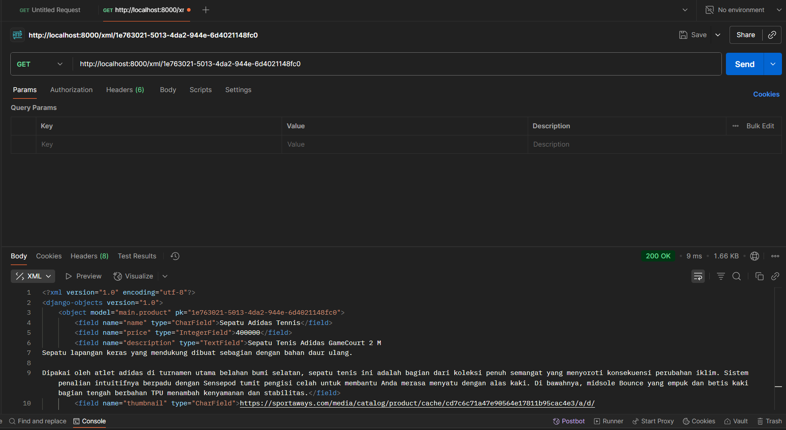
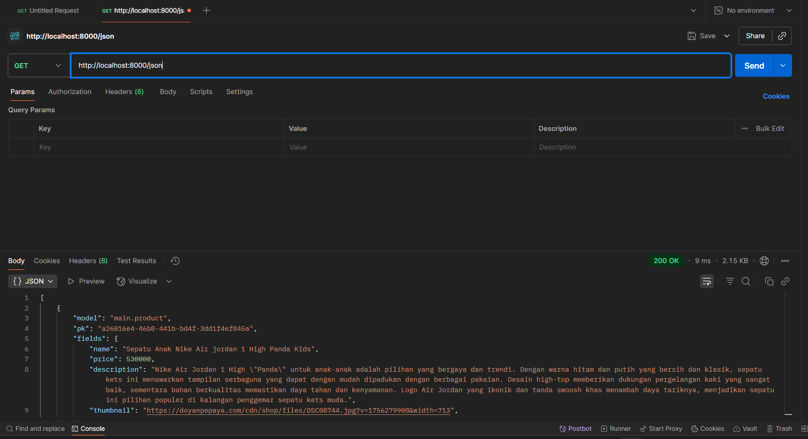
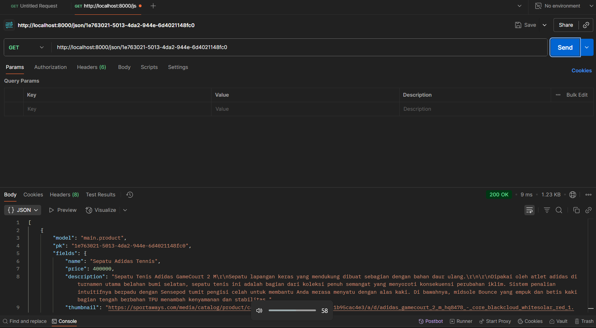

Link pws: https://jovian-felix-pacilstore.pbp.cs.ui.ac.id/

- README 6 : 
   1. Dalam komunikasi antara server dan client, ada 2 cara yaitu synchronous dan asynchronous. Pada komunikasi synchronous, client mengirim request ke server dan harus menunggu sampai server merespon sebelum dapat lanjut ke request berikutnya. Cara ini bisa membuat web menjadi lambat jika respons dari server juga lambat karena mengakibatkan request lain jadi terblokir. Sedangkan untuk komunikasi asynchronous, client mengirim request ke server tapi tidak menunggu respon langsung sehingga request lain tetap bisa dijalankan. Hal ini membuat beberapa request dapat berjalan secara paralel dalam waktu bersamaan. Dengan kata lain, web bisa memperbarui sebagian konten tanpa harus reload halaman dengan menggunakan metode asynchronous. 

   2. Salah satu penerapan asynchronous request adalah melalui penggunaan AJAX. AJAX sendiri merupakan singkatan dari Asynchronous JavaScript and XML. Melalui AJAX, data bisa dikirim atau diambil antara server dan client tanpa perlu reload satu halaman penuh. Berikut alurnya : 
   - Pertama, user atau client mentrigger suatu event seperti klik suatu tombol. Aksi tersebut membuat kode JavaScript untuk mengirim request ke server secara asynchronous, biasanya menggunakan metode seperti fetch() atau XMLHttpRequest.
   - Kedua, Django menerima request tersebut dan langsung mencocokkan ke urls.py dan melihat fungsi mana yang akan dieksekusi di views.py. Di sini, fungsi bisa saja mengambil, mengolah atau mengirim data ke database. Kemudian, server akan mengirim balik sebuah data mentah dengan format tertentu (JSON atau XML). 
   - Browser yang menerima respons tersebut tidak membuat halaman baru, melainkan hanya mengubah tampilan bagian tertentu sesuai respons yang didapat. Hal inilah yang membedakan AJAX dengan render biasa.

   3. Beberapa keuntungan AJAX dibanding render biasa di Django : 
   - Tidak perlu reload satu halaman penuh : Dengan menggunakan AJAX, hanya bagian tertentu saja yang diperbarui. Sedangkan dengan render biasa, setiap request akan membuat seluruh halaman di reload ulang.
   - Lebih efisien : AJAX hanya mengirim dan menerima data yang dibutuhkan saja dalam format JSON atau XML. Sedangkan render, biasanya mengirim ulang seluruh HTML,CSS, dan komponen lainnya.
   - Tampilan lebih dinamis : AJAX membuat halaman bisa diupdate secara real time. Jadi, misal pengguna yang melakukan suatu aksi, maka halaman tersebut langsung berubah tanpa perlu reload manual. Reload manual hanya diperlukan ketika seluruh html dan css berubah seperti pada penggunaan render biasa. Namun, jika hanya sebagian saja yang berubah, kita bisa menggunakan cara kerja DOM.

   4. Ada beberapa cara untuk memastikan keamanan saat menggunakan AJAX untuk fitur Login dan Register :
   - Selalu gunakan koneksi terenkripsi yaitu HTTPS. Dengan ini, maka pertukaran data antar client dan server selalu terlindungi dan data tidak bisa dicuri dari pihak ketiga. Selain itu, penggunaan HTTPS juga mencegah serangan Man In The Middle (MITM) yang bisa mengubah data sebelum sampai ke tujuan (server). 
   - Selalu sertakan CSRF token pada setiap fetch() atau AJAX POST. Hal ini mencegah penyerang untuk mengirim request atas nama akun user yang sedang login. Pastikan juga middleware CSRF aktif.
   - Pakai strip tags untuk mencegah serangan XSS. Hal ini akan menghapus seluruh tag HTML dari input pengguna, termasuk tag berbahaya seperti  sehingga tag tersebut tidak dieksekusi oleh browser client. Jadi nanti data yang tersimpan adalah data yang sudah bersih.

   5. Pengaruh penggunaan AJAX terhadap pengalaman pengguna : 
   - Halaman web menjadi lebih cepat dan responsif karena AJAX hanya memperbarui data yang terlibat, bukan seluruh halaman.
   - Interaksi dinamis dan real time karena kita tidak perlu reload untuk melihat perubahan menggunakan AJAX
   - Lebih hemat resource karena AJAX cuman mengambil data yang dibutuhkan bukan seluruh HTML dan CSS suatu halaman.
   - Transisi mulus karena tidak adanya reload manual, jadi terhindari dari tampilan seperti berubah secara tiba-tiba.

- README 5 :
   1. Secara umum, ada 5 urutan selector diurutkan berdasarkan prioritynya. Jika ada dua atau lebih selector pada suatu elemen, maka yang memiliki prioritas tertinggi yang diterapkan. Berikut urutan beserta penjelasannya (paling kuat ke lemah): 
   - Inline style : Selector yang langsung ditulis di elemen HTML, biasanya dengan atribut "style". Ini adalah jenis dengan prioritas tertinggi karena langsung berhubungan dengan elemen tersebut. Contohnya : 
 Paragraph 

   - ID selector : Selector yang bekerja berdasarkan ID tertentu. Setiap ID yang dibuat harus unik dan untuk best practice, setiap ID hanya boleh merepresentasikan satu elemen saja. Contohnya : 
Line 1

   - Classes, attribute, dan pseudo-classes : Selector yang bekerja berdasarkan class, attribute atau pseudo-class yang sama. Untuk class, hanya dicocokkan yaitu nama class. Sedangkan untuk attribute, bisa dicocokkan hanya jenis atribute atau lebih spesifik dengan nilai atribute tersebut. Terakhir, untuk pseudo-class, dicocokkan berdasarkan state yang sedang terjadi. Berbeda dengan ID selector dan inline style, ketiganya bisa dipakai untuk banyak elemen secara bersamaan. Contoh : 
   a. Classes
   
line1

   
LINE1

   .line1 {
   color: red;
   font-weight: bold;
   }

   b. Attributes
   <a href="https://goolge.com">Link 1</a>
   <a href="https://youtube.com">Link 2</a>

   Select semua elemen dengan atribute href :
   a[href] {       
   color: blue;
   }

   Select semua elemen dengan atribute href=https://goolge.com
   a[href="https://goolge.com"] {
   font-weight: bold;
   }

   c. Pseudo-class 
   <ul>
   <li>Item 1</li>
   </ul>

   li:hover {
   color: green;
   }

   - Elements dan pseudo-elements : Selector hanya berdasarkan jenis element. Untuk element, dia select semuanya secara keseluruhan. Sedangkan untuk pseudo-elements, dia hanya select bagian spesifik dari elemen. Contohnya : 
   a. Elements 
   
Ini paragraf satu

   p {
   color: blue;
   }

   b. Pseudo-elements 
   
Ini paragraf satu

   p::before {
   content: ">> "; /* menambahkan tanda sebelum teks */
   color: red;
   }

   - Universal selector : Jenis selector yang bersifat universal. Selector ini akan mempengaruhi semua elemen langsung. Contoh :
   * {
   margin: 0;
   padding: 0;
   box-sizing: border-box;
   }

   2. Reponsive design dalam pengembangan web adalah suatu metode pendekatan design dimana tampilan web menyesuaikan dari ukuran layar dan jenis perangkat dari user. Hal ini penting karena di era sekarang, web sudah bisa diakses dari perangkat mana saja (paling umum desktop dan mobile). Jika tampilan design bersifat tetap atau fixed, maka pengguna di beberapa perangkat tertentu akan mendapatkan tampilan yang kurang maksimal. Hampir semua aplikasi web zaman sekarang sudah menerapkan responsive design seperti instagram, tokopedia, dan lain-lain. Mereka dapat menyesuaikan tampilan webnya baik diakses dari perangkat dekstop ataupun mobile. Sedangkan contoh untuk non responsive design yaitu https://dequeuniversity.com/library/responsive/1-non-responsive. Di web tersebut, dia menggunakan fixed layout sehingga saat diakses melalui perangkat mobile, tampilannya tidak maksimal.

   3. Misal kita mempunyai sebuah wadah atau container untuk menampung suatu content. Padding adalah jarak dari content (isi elemen) terhadap tepi elemen. Tepi elemen disinilah yang disebut border. Jadi border adalah sebuah elemen yang membungkus content beserta paddingnya. Sedangkan margin adalah jarak dari suatu elemen (border) terhadap elemen lain. Contoh implementasinya seperti berikut : 
   
Isi Content

   .box {
   padding: 20px;
   border: 2px solid red;
   margin: 30px;        
   }

   4. Ada 2 jenis layout yang sering digunakan dalam mengatur tata letak antar elemen yaitu flex box dan grid layout. Flex box menggunakan konsep satu dimensi. Jadi, cuman ada satu baris atau satu kolom saja dalam flex box. Tapi di sini kita tetap bisa melakukan beberapa hal seperti ubah jarak antar elemen, atur alignnya, dan lain-lain. Flex box biasa digunakan jika kita memang hanya perlu fokus pada satu dimensi seperti navbar yang sudah dibuat dalam proyek ini. Sedangkan grid layout menggunakan konsep dua dimensi sehingga ada row dan column. Kita bisa bayangkan seperti tabel yang memiliki beberapa row dan column. Di sini juga kita bisa melakukan beberapa hal untuk mengatur layout sesuai keinginan kita. Contoh kegunaannya bisa kita lihat pada proyek ini bagian menampilkan list produk. Jadi, produk ditampilkan seperti tabel, dari kiri ke kanan kemudian atas ke bawah.

   5. - Checklist 1 : Membuat 2 fungsi baru di views.py yaitu edit_product dan delete_product yang mendapatkan object berdasarkan id. Kemudian, tambahkan juga kedua fungsi tersebut di bagian import dan urlpatterns di urls.py agar dapat terhubung.
      - Checklist 2 : Saya menggunakan framework tailwind untuk proyek ini sehingga saya menyambungkan django dengan tailwind di berkas base.html.
      - Checklist 3 : Buat berkas baru yaitu edit_product.html untuk tampilan form saat kita mau mengubah data sebuah produk. Lalu, mendesain ulang tampilan login, register, tambah product, edit product dan detail product menggunakan tailwind. Di sini, saya menggunakan template seperti tutorial sebagai dasar tetapi saya mengubah beberapa hal seperti warna, font size, alignment, dan lain-lain. 
      - Checklist 4,5,6 : Untuk halaman daftar produk, saya buat berkas baru yaitu card_product.html yang mengatur bagaimana setiap produk ditampilkan di list produk. Di sini, menggunakan jenis layout grid. Jika tidak ada produk yang ditemukan, maka akan menampilkan gambar dan informasi no product found. Tampilan card_product di sini juga saya mengikuti template dari tutorial tetapi ada beberapa hal yang saya ubah jadi tidak sama persis.
      - Checklist 7 : Tambahkan dua button untuk setiap card_product yaitu edit dan delete. Jika kita klik delete, maka produk tersebut akan terhapus di tampilan dan database. Sedangkan untuk button edit, dia akan mengarahkan kita pada tampilan sesuai dengan berkas edit_product.html dan kita dapat mengubah data produk kita di sana.
      - Checklist 8 : Terakhir, buat berkas navbar.html untuk tampilan navigasi web kita. Di sini, kita terapkan konsep responsive design dimana tampilan menyesuaikan pada parangkat yang digunakan (mobile atau desktop). 

- README 4 :
  1. Django AuthenticationForm merupakan suatu fitur bawaan django untuk menangani proses autentikasi (login) user. Secara default, form ini mempunyai 2 field untuk autentikasi yaitu username dan password. Setelah user memasukkan username dan passwordnya, django akan otomatis mencocokkan dengan database user. Jika cocok, maka autentikasi berhasil dan user dapat lanjut. Dengan adanya fitur bawaan ini, tentu saja django menawarkan beberapa kelebihan seperti :
  - Tidak perlu membuat suatu form untuk proses autentikasi dari nol sehingga dapat mempermudah dan mempercepat proses pengembangan.
  - Sudah terintegrasi dengan django sendiri, sehingga dapat langsung menggunakan berbagai fungsi bawaan django seperti authenticate(), login(), dan lain-lain.
  Namun, terdapat juga beberapa kekurangan seperti :
  - Karena fitur ini adalah bawaan, maka bisa dibilang ini adalah proses autentikasi secara default untuk suatu web sehingga kurang fleksibel.
  - Hanya mendukung autentikasi berupa username dan password
  2. Autentikasi adalah sebuah proses untuk memastikan suatu identitas user. Jadi, django akan meminta suatu user untuk memasukkan username dan password (secara umum) untuk mengetahui siapa user tersebut. Salah satu penerapan yang dilakukan django adalah fitur bawaan AuthenticationForm tadi untuk proses autentikasi. Sedangkan otorisasi adalah sebuah proses untuk menentukan hak akses apa saja yang dimiliki oleh suatu user. Jadi, setelah django mengetahui siapa suatu user melalui autentikasi, django akan menentukan batasan akses untuk user tersebut. Salah satu penerapan pada django yang sudah kita lakukan di tugas ini yaitu dengan adanya @login_required(login_url='/login') pada function show_main dan show_product. Hal tersebut berarti user harus melakukan login dulu untuk mendapatkan akses ke show_main dan show_product.
  3. Session dan cookie adalah dua hal berbeda terkait penyimpanan suatu state. Cookie adalah data user yang disimpan di browser user sehingga dapat dikirimkan ke server setiap melakukan request. Dengan ini, kelebihan utama cookie yaitu sederhana karena kita tidak perlu menyiapkan server untuk menampung data user. Namun, dengan disimpannya data di browser user, data tersebut lebih rentan karena bisa dibaca dan dimodifikasi user. Untuk penyimpanan cookie sendiri juga tidak terlalu besar (ada batasannya) yaitu sekitar 4 KB. Sedangkan session adalah metode dimana data user disimpan di server. Jadi yang disimpan di browser user hanya session ID nya saja. Hal ini menyebabkan data lebih aman dan bisa disimpan dalam jumlah relatif lebih besar dari cookie. Kekurangannya, kita harus menyiapkan ruang penyimpanan di server untuk menyimpan data-data ini, terutama ketika jumlah user yang banyak.
  4. Cookies tidak sepenuhnya aman untuk digunakan dalam pengembangan suatu web. Ada beberapa risiko penyerangan terkait cookies yang harus diperhatikan, antara lain : 
  - SSL/HTTPS : Tanpa menggunakan https, penyerang dapat mengambil data credentials saat server dan client berkomunikasi. Penyerang bisa juga mengubah data saat proses komunikasi.
  - CSRF : Penyerang dapat melakukan berbagai tindakan jahat menggunakan browser milik user yang sudah terautentikasi tanpa sepengetahuan korban.
  - XSS (Cross-Site Scripting) : Penyerang menyisipkan suatu kode JavaScript ke halaman web user lain. Hal ini berbahaya karena kode tersebut dieksekusi oleh browser dan penyerang bisa mengambil cookies milik user lain.
  Untuk mengatasi beberapa serangan yang sering terjadi, django sudah memberikan beberapa perlindungan seperti : 
  - Support HTTPS : django memberikan setting SESSION_COOKIE_SECURE dan CSRD_COOKIE_SECURE yang menjamin cookie dikirimkan hanya melalui HTTPS
  - CSRF Protection : django menyisipkan csrf_token pada setiap form yang dikirim sehingga setiap request dapat diverifikasi melalui token yang sudah dibuat tadi
  - XSS Protection : django memberikan sebuah templates dimana django melakukan escape untuk beberapa karakter spesifik yang dianggap berbahaya untuk HTML. 
  5. - Checklist 1 : Untuk registrasi, kita menggunakan impor dari django yaitu UserCreationForm dan messages. UserCreationForm memudahkan untuk pembuatan form untuk pendaftaran. Setelah itu, kita tambahkan function khusus registrasi untuk membuat akun pengguna di views.py dan tambahkan juga di urls.py agar bisa terhubung.  Selanjutnya, kita juga bikin tampilan dengan berkas html khusus form pendaftaran yaitu register.html. Sedangkan untuk proses login, kita juga impor fitur bawaan django untuk mempermudah kita yaitu AuthenticationForm, login, dan authenticate. Kemudian, tambahkan function login di views.py dan di urls.py. Buat juga berkas tampilan untuk halaman login yaitu login.html. Terakhir, import logout dari django untuk proses logout. Tambahkan function logout di views.py and urls.py, serta tambahkan button untuk logout di main.html. 
   - Checklist 2 : Untuk tes fungsionalitas fitur login dan logout, buat 2 akun dimana masing-masing akun menambahkan 3 product bebas sebagai data dummy untuk pengecekan.
   - Checklist 3 : Import user dari django di views.py dan buat field baru khusus user di models.py. Nantinya, hubungan product dengan user yaitu many to one. Setelah itu, kita lakukan migrate untuk mencatat perubahan di models.py. Selanjutnya, kita modifikasi function create_product di views.py sehingga saat kita membuat product, product tersebut tidak langsung tersimpan di database. Kita bisa lakukan modifikasi dengan menambahkan info tentang nama pengguna yang sedang login (pembuatnya). Lalu, modifikasi function show_main agar kita bisa filter product berdasarkan user. Tambahkan juga button My Product dan All Product di main.html, serta nama pembuatnya di product_detail.html.
   - Checklist 4 : Import HttpResponseRedirect, reverse, dan datetime dari django di views.py. Selanjutnya, ubah function login_user dan logout_user sehingga saat login, django bisa menyimpan cookie (last_login) yang berisi timestamp terakhir kali user login dan saat logout, django menghapus last_loginnya. Kemudian, di function show_main, tambahkan nama user yang sedang login dan juga cookies di bagian context sehingga nanti bisa terbaca di tampilan main.html. Tambahkan juga informasi last_login di main.html.

- README 3 : 
   1. Data delivery adalah sebuah proses pengiriman data dari satu titik ke titik lain, biasanya antara server dan client. Dalam mengembangkan suatu platform, data delivery ini sangat penting agar platform tersebut bekerja secara fungsional dan interaktif. Tanpa data delivery, user tidak bisa mengirim maupun melihat data di database server sehingga platform tidak bisa menampilkan update terbaru. Namun, dengan adanya data delivery seperti JSON, XML, dan lain-lain, data bisa dikirim dari server ke client serta sebaliknya. Jika kita mengembangkan platform kita di sistem lain seperti mobile app, data juga dapat dikirim dari server agar sinkron.

   2. Baik JSON dan XML memiliki keunggulan dan kegunaannya masing-masing. 
   Beberapa keunggulan JSON :
   - Ringan dan memiliki volume data lebih kecil
   - Mudah dibaca dan ditulis karena formatnya sederhana
   - Lebih cepat di parse
   - Mendukung beberapa bahasa pemrograman

   Beberapa keunggulan XML : 
   - Mendukung struktur data yang kompleks
   - Memungkinkan penambahan komentar
   - Mendukung namespace untuk menghindari potensi konflik antar elemen

   JSON lebih populer dibanding XML karena sifatnya yang lebih ringan, lebih mudah dibaca, dan lain-lain seringkali sudah cukup digunakan bagi kebanyakan platform di era sekarang. Namun, XML tetap digunakan untuk beberapa platform yang membutuhkan validasi ketat dan struktur data yang kompleks.

   3. Method is_valid() dari Django Form merupakan salah satu method yang penting saat kita membuat suatu form. Beberapa fungsi utamanya yaitu : 
   - Melakukan pengecekkan pada setiap input agar sesuai dengan tipe data dan constraint di field model
   - Dapat menjalankan custom validation juga untuk validasi tambahan
   - Menyediakan dictionary (cleaned_data) yang berisi data yang sudah bersih dan siap disimpan di database
   - Jika validasi return false, maka method mengisi atribut errors pada form agar pesan dapat ditampilkan ke user

   Dengan adanya method ini, kita tidak harus periksa semua input secara manual satu per satu sehingga mempermudah di sisi pengembangannya

   4. Kita butuh csrf_token saat membuat form di Django untuk melindungi platform kita dari serangan CSRF (Cross-Site Request Forgery). Jadi, csrf_token adalah sebuah token unik yang dibuat oleh Django untuk dikirim bersama form. Jadi, setiap kali ada request ke server, Django akan cek tokennya dan dicocokkan dengan yang sudah dibuat. Jika tidak cocok, maka request langsung ditolak. Tanpa adanya csrf_token ini, platform kita menjadi rentan akan serangan CSRF, dimana penyerang menggunakan browser korban (user yang sudah terverifikasi) untuk mengirim request ke server dan melakukan berbagai aksi tanpa persetujuan user.

   5. Step by step saya dalam menyelesaikan setiap checklist : 
   - Checklist 1 : Membuat 2 fungsi di views.py untuk query tiap object Product, kemudian menggunakan serialize untuk mengubahnya ke format XML atau JSON. Terakhir return sebuah respons HTTP yang dikirim ke client. Selain itu, buat juga 2 fungsi yang query dan filter object Product berdasarkan id nya. Kemudian ubah ke format JSON/XML dengan serialize dan kirim hasil respons HTTP ke client. Di 2 function ini, kita buat try except jika terjadi error DoesNotExist jika object tidak ditemukan.
   - Checklist 2 : Untuk setiap fungsi baru yang sudah ditambahkan tadi, buat juga urlnya di urls.py agar nanti saat client memberikan request dengan url tertentu, maka keempat fungsi itu dapat berjalan.
   - Checklist 3 : Ubah berkas main.html di direktori main/templates. Jika belum ada object Product, maka tampilkan "Belum ada produk pada pacilstore.". Namun, jika sudah ada Product, maka kita looping tiap object tersebut dan tampilkan secara singkat untuk masing-masing Product. Lalu, tambahkan juga tombol Read More untuk pindah ke halaman product_detailed.html sehingga suatu Product ditampilkan secara lengkap. Terakhir, tambahkan tombol Add Product yang memindahkan ke halaman create_product untuk mengisi sebuah form.
   - Checklist 4 : Buat forms.py untuk bikin struktur formnya dan sebuah berkas html yaitu create_product.html untuk menampilkan ke user.
   - Checklist 5 : Buat sebuah berkas html yaitu product_detailed.html yang menampilkan informasi lengkap tentang suatu produk.
   - Checklist 7 : Membuka Postman dan mencoba keempat fungsi tersebut dengan menggunakan GET dari url yang kita kasih. Screenshot hasilnya.
   - Checklist 8 : Melakukan push ke github dan pws untuk menyimpan perubahan.

   6. Sejauh ini sudah baik, saya dapat mengerjakan semua tutorial dengan lancar karena instruksinya yang jelas dan juga ada asdos yang stand by jika ada hal yang ingin ditanyakan.

   Gambar Screenshot Postman : 

   

   

   

   

- README 2
  Jawaban : 
   1. Cara saya untuk menyelesaikan checklist tersebut step by step yaitu dengan mereview kembali tutorial dan memahami tiap langkah-langkahnya. 
      Berikut uraiannya : 
      - Checklist 1 : Pertama, saya siapkan dulu dengan membuat repositori baru di github dan juga direktori lokal yang akan menjadi tempat proyeknya. Direktori lokal tersebut kemudian di inisiasi dengan git dan dihubungkan ke repositori yang sudah dibuat tadi. Lalu, saya mengaktifkan virtual environment di direktori lokal tadi, dan download semua requirements yang dibutuhkan. Setelah selesai download, saya bisa mulai buat sebuah projek django. Di sini, saya juga melakukan konfigurasi dasar untuk proyek ini.
      - Checklist 2 : Membuat aplikasi main dengan menjalankan perintah di terminal. Di dalam aplikasi main, saya juga menyiapkan beberapa template html yang akan digunakan nantinya.
      - Checklist 3 : Pada file urls.py di level proyek, saya menambahkan fungsi include untuk menghubungkan proyek dengan aplikasi main. Dengan begitu, semua routing yang ada di aplikasi main dapat dikenali di proyek utama.
      - Checklist 4 : Membuat blueprint desain tabel database di models.py sesuai ketentuan yang diminta. Tapi ini hanya blueprint, database aslinya baru terbentuk setelah kita melakukan proses migrasi.
      - Checklist 5 : Buka views.py dan menambah fungsi-fungsi yang menerima parameter request. Fungsi-fungsi ini nantinya akan return sebuah fungsi render dengan berkas html yang sesuai. 
      - Checklist 6 : Menambah path untuk fungsi view di bagian list urlpatterns di urls.py pada level aplikasi main. Sehingga, setiap URL yang dipanggil bisa diarahkan ke view yang tepat, lalu ditampilkan dengan template yang sesuai.
      - Checklist 7 : Terakhir, buka web https://pbp.cs.ui.ac.id/ dan create new project. Di sana, kita nanti akan push semua perubahan pada proyek kita. Kita juga harus push ke repositori github agar semua perubahan tercatat.

   2. Link gambar : https://web-cms.biznetgio.com/uploads/django_77d5263d13.jpg
      Alur : Pertama, client akan mengirimkan request ke server. Setelah django menerima request tersebut, ia langsung ke urls.py untuk melihat pola URL dan menentukan fungsi mana di views.py yang akan dijalankan. Di sini, fungsi view bisa mengambil data dari models.py dan mengirim data ke template. Jadi bisa dibilang proses view ini adalah otak dari aplikasi yang memutuskan apa yang harus dilakukan pada setiap request. Setelah view mendapat data dari model, ia langsung memilih template HTML mana untuk ditampilkan ke client. Nah setelah itu semua, baru django akan mengirim hasilnya sebagai response ke client.

   3. Peran settings.py dalam django cukup penting. Bisa dibilang, settings.py seperti buku aturan untuk proyek django kita. Di sini, kita yang     
      mengatur bagaimana keseluruhan projek kita akan berjalan. Beberapa tugas setting.py yaitu :
      - Konfigurasi dasar proyek. Di sini, kita bisa menyimpan beberapa konfigurasi untuk proyek kita seperti zona waktu dan bahasa.
      - Menyimpan daftar aplikasi mana saja yang aktif dalam proyek kita. Daftar aplikasi ini bisa kita temukan di bagian INSTALLED_APPS.
      - Konfigurasi database yang kita gunakan (menentukan database mana yang kita gunakan).
      - Menyimpan pengaturan keamanan (security dan credential).
      - Menentukan middleware mana saja yang digunakan.
      - Mengatur bagaimana django mencari file-file html (template).

   4. Saat kita membuat model di models.py, sebenarnya kita hanya membuat semacam blueprint tabel, tapi belum benar-benar ada di databasenya.  
      Blueprint tersebut akan dicatat dalam sebuah file migrasi saat kita menjalankan perintah makemigrations. Setelah itu, melalui perintah migrate, django akan mengeksekusi file migrasi tersebut sehingga tabel dan kolom benar-benar dibuat di database. Jadi, ketika kita membuat perubahan di models.py, kita harus melakukan migrasi agar perubahan tersebut dicatat dan diterapkan ke database asli.

   5. Menurut saya, Framework django sering dijadikan permulaan pembelajaran pengembangan perangkat lunak karena sifatnya yang mudah dan lengkap. 
      Django sendiri sudah dilengkapi berbagai fitur bawaan yang mempermudah pembelajaran seperti ORM untuk database. Django juga terstruktur dengan menerapkan konsep seperti MVT (Model View Template), yang membuat alur kerja lebih terorganisir dan jelas. Terakhir, django menggunakan salah satu bahasa pemrograman yang relatif lebih mudah dibanding kebanyakan bahasa lainnya yaitu python. Hal-hal inilah yang membuat django menjadi pilihan yang tepat untuk pembelajaran pengembangan perangkat lunak pertama kali.

   6. Sejauh ini, semua tutorial yang saya kerjakan berjalan dengan lancar. Semua panduan dan instruksi di tutorial tersebut dapat dipahami dengan 
      mudah. Para asdos juga selalu stand by di discord jika ada pertanyaan.