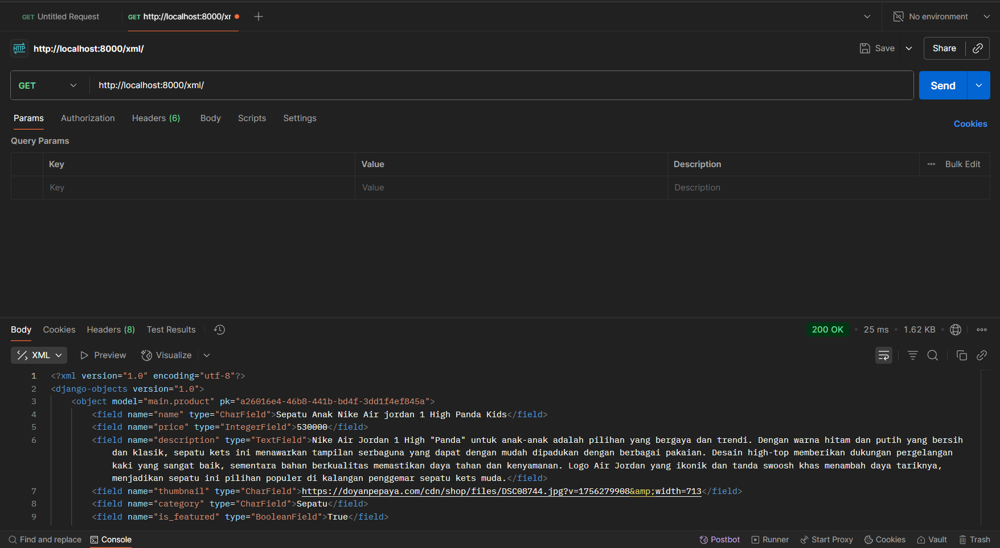

Link pws: https://jovian-felix-pacilstore.pbp.cs.ui.ac.id/

README 3 : 
1. Data delivery adalah sebuah proses pengiriman data dari satu titik ke titik lain, biasanya antara server dan client. Dalam mengembangkan suatu platform, data delivery ini sangat penting agar platform tersebut bekerja secara fungsional dan interaktif. Tanpa data delivery, user tidak bisa mengirim maupun melihat data di database server sehingga platform tidak bisa menampilkan update terbaru. Namun, dengan adanya data delivery seperti JSON, XML, dan lain-lain, data bisa dikirim dari server ke client serta sebaliknya. Jika kita mengembangkan platform kita di sistem lain seperti mobile app, data juga dapat dikirim dari server agar sinkron.

2. Baik JSON dan XML memiliki keunggulan dan kegunaannya masing-masing. 
Beberapa keunggulan JSON :
- Ringan dan memiliki volume data lebih kecil
- Mudah dibaca dan ditulis karena formatnya sederhana
- Lebih cepat di parse
- Mendukung beberapa bahasa pemrograman

Beberapa keunggulan XML : 
- Mendukung struktur data yang kompleks
- Memungkinkan penambahan komentar
- Mendukung namespace untuk menghindari potensi konflik antar elemen

JSON lebih populer dibanding XML karena sifatnya yang lebih ringan, lebih mudah dibaca, dan lain-lain seringkali sudah cukup digunakan bagi kebanyakan platform di era sekarang. Namun, XML tetap digunakan untuk beberapa platform yang membutuhkan validasi ketat dan struktur data yang kompleks.

3. Method is_valid() dari Django Form merupakan salah satu method yang penting saat kita membuat suatu form. Beberapa fungsi utamanya yaitu : 
- Melakukan pengecekkan pada setiap input agar sesuai dengan tipe data dan constraint di field model
- Dapat menjalankan custom validation juga untuk validasi tambahan
- Menyediakan dictionary (cleaned_data) yang berisi data yang sudah bersih dan siap disimpan di database
- Jika validasi return false, maka method mengisi atribut errors pada form agar pesan dapat ditampilkan ke user

Dengan adanya method ini, kita tidak harus periksa semua input secara manual satu per satu sehingga mempermudah di sisi pengembangannya

4. Kita butuh csrf_token saat membuat form di Django untuk melindungi platform kita dari serangan CSRF (Cross-Site Request Forgery). Jadi, csrf_token adalah sebuah token unik yang dibuat oleh Django untuk dikirim bersama form. Jadi, setiap kali ada request ke server, Django akan cek tokennya dan dicocokkan dengan yang sudah dibuat. Jika tidak cocok, maka request langsung ditolak. Tanpa adanya csrf_token ini, platform kita menjadi rentan akan serangan CSRF, dimana penyerang menggunakan browser korban (user yang sudah terverifikasi) untuk mengirim request ke server dan melakukan berbagai aksi tanpa persetujuan user.

5. Step by step saya dalam menyelesaikan setiap checklist : 
- Checklist 1 : Membuat 2 fungsi di views.py untuk query tiap object Product, kemudian menggunakan serialize untuk mengubahnya ke format XML atau JSON. Terakhir return sebuah respons HTTP yang dikirim ke client. Selain itu, buat juga 2 fungsi yang query dan filter object Product berdasarkan id nya. Kemudian ubah ke format JSON/XML dengan serialize dan kirim hasil respons HTTP ke client. Di 2 function ini, kita buat try except jika terjadi error DoesNotExist jika object tidak ditemukan.
- Checklist 2 : Untuk setiap fungsi baru yang sudah ditambahkan tadi, buat juga urlnya di urls.py agar nanti saat client memberikan request dengan url tertentu, maka keempat fungsi itu dapat berjalan.
- Checklist 3 : Ubah berkas main.html di direktori main/templates. Jika belum ada object Product, maka tampilkan "Belum ada produk pada pacilstore.". Namun, jika sudah ada Product, maka kita looping tiap object tersebut dan tampilkan secara singkat untuk masing-masing Product. Lalu, tambahkan juga tombol Read More untuk pindah ke halaman product_detailed.html sehingga suatu Product ditampilkan secara lengkap. Terakhir, tambahkan tombol Add Product yang memindahkan ke halaman create_product untuk mengisi sebuah form.
- Checklist 4 : Buat forms.py untuk bikin struktur formnya dan sebuah berkas html yaitu create_product.html untuk menampilkan ke user.
- Checklist 5 : Buat sebuah berkas html yaitu product_detailed.html yang menampilkan informasi lengkap tentang suatu produk.
- Checklist 7 : Membuka Postman dan mencoba keempat fungsi tersebut dengan menggunakan GET dari url yang kita kasih. Screenshot hasilnya.
- Checklist 8 : Melakukan push ke github dan pws untuk menyimpan perubahan.

6. Sejauh ini sudah baik, saya dapat mengerjakan semua tutorial dengan lancar karena instruksinya yang jelas dan juga ada asdos yang stand by jika ada hal yang ingin ditanyakan.

Gambar Screenshot Postman : 

README 2
Jawaban : 
1. Cara saya untuk menyelesaikan checklist tersebut step by step yaitu dengan mereview kembali tutorial dan memahami tiap langkah-langkahnya. 
   Berikut uraiannya : 
   - Checklist 1 : Pertama, saya siapkan dulu dengan membuat repositori baru di github dan juga direktori lokal yang akan menjadi tempat proyeknya. Direktori lokal tersebut kemudian di inisiasi dengan git dan dihubungkan ke repositori yang sudah dibuat tadi. Lalu, saya mengaktifkan virtual environment di direktori lokal tadi, dan download semua requirements yang dibutuhkan. Setelah selesai download, saya bisa mulai buat sebuah projek django. Di sini, saya juga melakukan konfigurasi dasar untuk proyek ini.
   - Checklist 2 : Membuat aplikasi main dengan menjalankan perintah di terminal. Di dalam aplikasi main, saya juga menyiapkan beberapa template html yang akan digunakan nantinya.
   - Checklist 3 : Pada file urls.py di level proyek, saya menambahkan fungsi include untuk menghubungkan proyek dengan aplikasi main. Dengan begitu, semua routing yang ada di aplikasi main dapat dikenali di proyek utama.
   - Checklist 4 : Membuat blueprint desain tabel database di models.py sesuai ketentuan yang diminta. Tapi ini hanya blueprint, database aslinya baru terbentuk setelah kita melakukan proses migrasi.
   - Checklist 5 : Buka views.py dan menambah fungsi-fungsi yang menerima parameter request. Fungsi-fungsi ini nantinya akan return sebuah fungsi render dengan berkas html yang sesuai. 
   - Checklist 6 : Menambah path untuk fungsi view di bagian list urlpatterns di urls.py pada level aplikasi main. Sehingga, setiap URL yang dipanggil bisa diarahkan ke view yang tepat, lalu ditampilkan dengan template yang sesuai.
   - Checklist 7 : Terakhir, buka web https://pbp.cs.ui.ac.id/ dan create new project. Di sana, kita nanti akan push semua perubahan pada proyek kita. Kita juga harus push ke repositori github agar semua perubahan tercatat.

2. Link gambar : https://web-cms.biznetgio.com/uploads/django_77d5263d13.jpg
   Alur : Pertama, client akan mengirimkan request ke server. Setelah django menerima request tersebut, ia langsung ke urls.py untuk melihat pola URL dan menentukan fungsi mana di views.py yang akan dijalankan. Di sini, fungsi view bisa mengambil data dari models.py dan mengirim data ke template. Jadi bisa dibilang proses view ini adalah otak dari aplikasi yang memutuskan apa yang harus dilakukan pada setiap request. Setelah view mendapat data dari model, ia langsung memilih template HTML mana untuk ditampilkan ke client. Nah setelah itu semua, baru django akan mengirim hasilnya sebagai response ke client.

3. Peran settings.py dalam django cukup penting. Bisa dibilang, settings.py seperti buku aturan untuk proyek django kita. Di sini, kita yang     
   mengatur bagaimana keseluruhan projek kita akan berjalan. Beberapa tugas setting.py yaitu :
   - Konfigurasi dasar proyek. Di sini, kita bisa menyimpan beberapa konfigurasi untuk proyek kita seperti zona waktu dan bahasa.
   - Menyimpan daftar aplikasi mana saja yang aktif dalam proyek kita. Daftar aplikasi ini bisa kita temukan di bagian INSTALLED_APPS.
   - Konfigurasi database yang kita gunakan (menentukan database mana yang kita gunakan).
   - Menyimpan pengaturan keamanan (security dan credential).
   - Menentukan middleware mana saja yang digunakan.
   - Mengatur bagaimana django mencari file-file html (template).

4. Saat kita membuat model di models.py, sebenarnya kita hanya membuat semacam blueprint tabel, tapi belum benar-benar ada di databasenya.  
   Blueprint tersebut akan dicatat dalam sebuah file migrasi saat kita menjalankan perintah makemigrations. Setelah itu, melalui perintah migrate, django akan mengeksekusi file migrasi tersebut sehingga tabel dan kolom benar-benar dibuat di database. Jadi, ketika kita membuat perubahan di models.py, kita harus melakukan migrasi agar perubahan tersebut dicatat dan diterapkan ke database asli.

5. Menurut saya, Framework django sering dijadikan permulaan pembelajaran pengembangan perangkat lunak karena sifatnya yang mudah dan lengkap. 
   Django sendiri sudah dilengkapi berbagai fitur bawaan yang mempermudah pembelajaran seperti ORM untuk database. Django juga terstruktur dengan menerapkan konsep seperti MVT (Model View Template), yang membuat alur kerja lebih terorganisir dan jelas. Terakhir, django menggunakan salah satu bahasa pemrograman yang relatif lebih mudah dibanding kebanyakan bahasa lainnya yaitu python. Hal-hal inilah yang membuat django menjadi pilihan yang tepat untuk pembelajaran pengembangan perangkat lunak pertama kali.

6. Sejauh ini, semua tutorial yang saya kerjakan berjalan dengan lancar. Semua panduan dan instruksi di tutorial tersebut dapat dipahami dengan 
   mudah. Para asdos juga selalu stand by di discord jika ada pertanyaan.